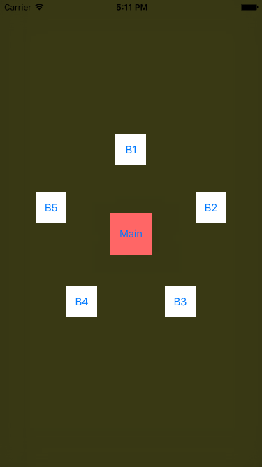
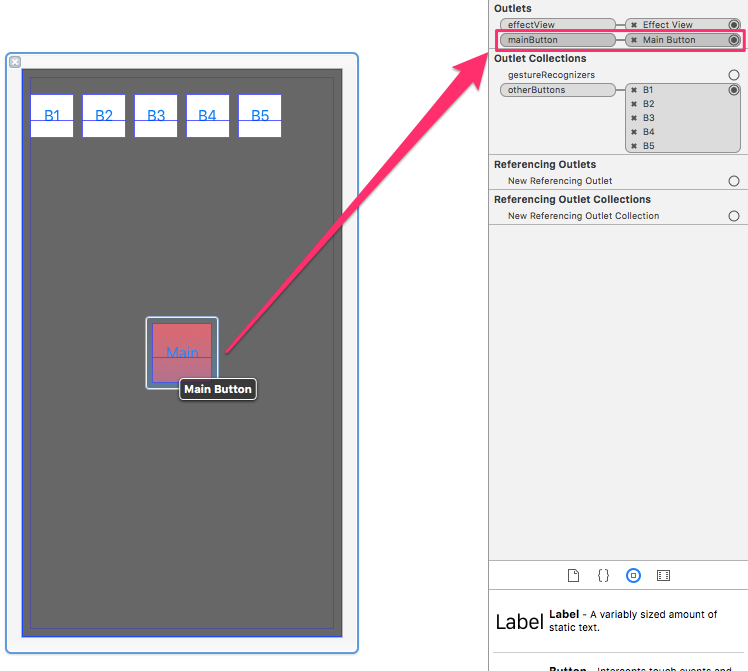

[](LICENSE)
[](https://www.paypal.com/cgi-bin/webscr?cmd=_s-xclick&hosted_button_id=LC58N7VZUST5N)
[](https://github.com/Carthage/Carthage)


# SRPPopupMenu

[中文說明](README/README_TW.md)

A dragable, easy customizable, popup menu.

Online [Demo][1] powered by [appetize][2]




# Usage
You should use your own menu, not SRPPopupMenu.

Follow the steps to create your custom menu or reference the [DemoMenu][3] class.


## Step1
Create your custom menu subclass SRPPopupMenu.

Override the method `awakeFromNib` and setting the animation properties.

> **Don't forget to call `[super awakeFromNib]`.**

```ObjC
- (void)awakeFromNib
{
    [super awakeFromNib];
    
    self.otherButtonsAnimationDuration  = .5f;
    self.otherButtonsAnimationDamping   = .4f;
    self.otherButtonsPosionStartAngle   = -90.0f;
    self.othersButtonDistanceFromCenter = 120.0f;
    self.mainButtonAnimationDuration    = .5f;
    self.mainButtonAnimationDamping     = .6f;
}
```


## Step2
Create a xib file named with your custom menu class name.

Disable the AutoLayout and Size-Class.


Drag a button to be MainButton, and connect to IBOutlet.




Drag some buttons to be otherButtons, and conncet to IBCollections.

> **Important: you must to set the button tag, start 1 to N.**


Now you can use your custom menu.

```Objc
// Show the menu
[[YourMenu singleton]show];

// Hide the menu
[[YourMenu singleton]hide];
```


# Handle button clicked
The SRPPopupMenu using NSNotification to handle button clicked,

```ObjC
- (void)viewDidLoad
{
    [super viewDidLoad];

    [[NSNotificationCenter defaultCenter]addObserver:self
                                            selector:@selector(__menuButtonClickedNotification:)
                                                name:SRPPopupMenuButtonClickedNotification
                                              object:nil];
    
    
}

- (void)__menuButtonClickedNotification:(NSNotification *)sender
{
    NSNumber *tag = sender.object;
    NSLog(@"%@", tag);
}
```


# Handle menu open / close
If you want to handle the menu open / close, you must implement the SRPPopupMenuProtocol methods.

Also see [DemoMenu][3] class.

```ObjC
// Menu will open
- (void)menuWillOpen

// Menu opened
- (void)menuDidOpen

// Menu will close
- (void)menuWillClose

// Menu closed
- (void)menuDidClose
```


[1]: https://appetize.io/app/u3ppurce2xgyup7r58q9hpxjp0 "Demo"
[2]: https://appetize.io "appetize"
[3]: Demo/DemoMenu.m "DemoMenu"
